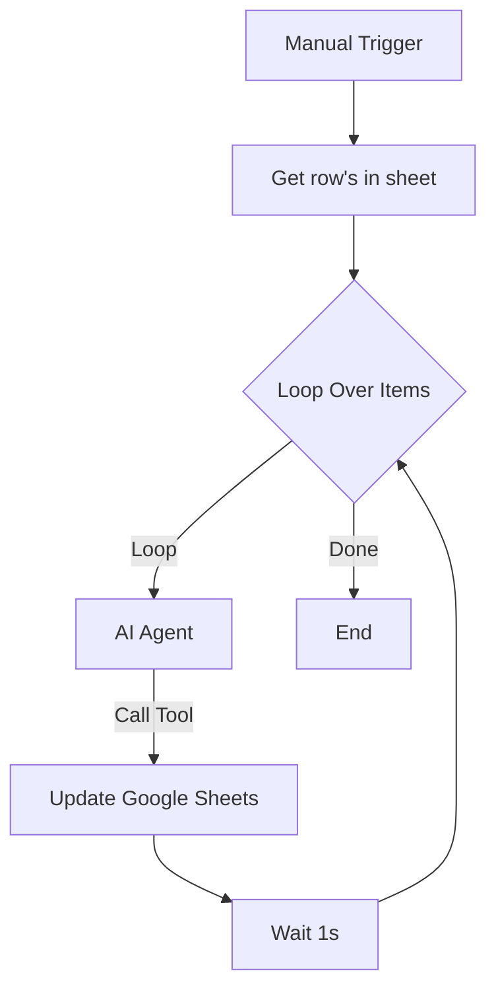

# 🤖 n8n AI Customer Service Assistant: 客服資料結構化小幫手

這是一個將 **n8n AI Agent** 與 **Google Sheets** 深度整合的自動化工作流。它能讓 AI 自動讀取原始的客服對話內容，即時辨識案件類型、摘要重點並提取人員資訊，最後精準回填至雲端表格。

## 📖 流程簡介
本專案實現了以下核心邏輯：

* **數據抓取**：從 Google Sheet 提取原始「客服內容」與對應的 `row_number`。
* **AI 推理 (Agent)**：AI 解析對話紀錄，自動判斷「客服類型」、撰寫「內容摘要」、並辨識「客服人員」與「顧客姓名」。
* **實時回填 (Update)**：AI 自動調用 Google Sheets 工具，將結構化後的資料回傳至指定欄位。
* **批次執行**：透過 Loop 節點逐一處理每一筆對話，確保資料處理的穩定性。

---
## 🔗 節點功能說明

### 1. Manual Trigger
手動點擊 **「When clicking ‘Execute workflow’」** 以啟動整個流程，適合測試或一次性批次處理。

### 2. Get row(s) in sheet
從指定的 Google Sheet（工作表名稱：**資料結構化**）讀取所有待處理的客服內容。

### 3. Loop Over Items
核心循環機制，將資料逐筆或分批處理，以避免短時間內大量 API 請求造成系統過載。

### 4. AI Agent（OpenAI）
- **模型**：`gpt-4.1-mini`
- **系統指令**：  
  接收「客服內容」資料，並要求 AI **以繁體中文**提取以下資訊：
  - `type`：投訴、詢價、感謝、售後（四選一）
  - `excerpt`：濃縮至約 30 字的內容摘要
  - `staff`：對話中的客服或內部人員姓名
  - `customer`：對話中的客戶姓名

### 5. Google Sheets Tool（Update）
當 AI Agent 完成分析後，依據 `row_number` 精準匹配原始資料列，並自動更新以下欄位：
- `type`
- `excerpt`
- `staff`
- `customer`

### 6. Wait
每次資料更新完成後，加入 **1 秒等待時間**，以降低 API 呼叫頻率，確保流程穩定執行。

---

## 📊 資料來源說明

本專案對接的 Google Sheets 包含原始客服對話紀錄，以及預留的結構化欄位，供 AI 自動補齊。

📎 **Google Sheets 連結**  
👉 點此查看客服資料結構化表（https://docs.google.com/spreadsheets/d/12R3GaPyQJSAPs6scPDasvhyVxC27jicx56Cf18Yjs_Q/edit?gid=0#gid=0）

---

## 🛠️ 安裝與使用方式

### 1️⃣ 匯入工作流
將專案提供的 `客服資料結構化.json` 檔案匯入至 n8n。

### 2️⃣ 設定憑證
- 設定 **OpenAI API Key**
- 設定 **Google Sheets OAuth2** 授權

### 3️⃣ 檢查試算表結構
確認 Google Sheet 內包含以下標題欄位：

- `客服內容`
- `type`
- `excerpt`
- `staff`
- `customer`
- `row_number`

### 4️⃣ 啟動工作流
點擊 **Execute workflow**，系統將自動：
- 分析客服對話內容
- 進行分類與摘要
- 回寫結構化結果至對應欄位

---

## ✅ 適用場景

- 客服對話分類與統計分析
- 投訴與售後案件快速彙整
- 建立後續 BI 或報表分析資料源
- AI 驅動的資料清洗與結構化流程示範

---

## 🏗️ 流程結構 (Workflow Structure)

### 視覺化流程圖

## 📸 執行截圖範例

